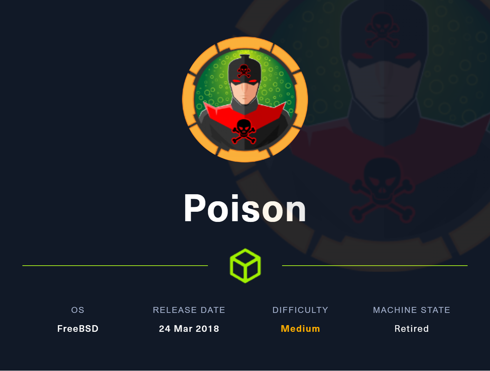
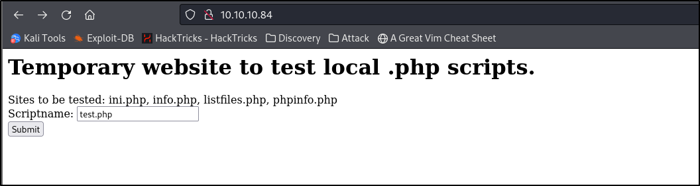

# Resolution summary

- LFI on main webpage
- Reverse Shell via LFI
- Lateral escalation via weak encrypted password
- Privilege escalation via VNC running as root and password in zip file
- Root obtained and flags captured

## Improved skills

- Setting up a multi-port port forward via SSH
- Exploiting LFI via phpinfo
- Formatting output via sed

## Used tools

- nmap
- gobuster

---

# Information Gathering

Scanned all TCP ports:

```bash
#nmap scan
nmap -sV -sC -v -p- -T4 -oN nmap/initial $IP --open

#nmap results
PORT   STATE SERVICE VERSION
22/tcp open  ssh     OpenSSH 7.2 (FreeBSD 20161230; protocol 2.0)
| ssh-hostkey: 
|   2048 e3:3b:7d:3c:8f:4b:8c:f9:cd:7f:d2:3a:ce:2d:ff:bb (RSA)
|   256 4c:e8:c6:02:bd:fc:83:ff:c9:80:01:54:7d:22:81:72 (ECDSA)
|_  256 0b:8f:d5:71:85:90:13:85:61:8b:eb:34:13:5f:94:3b (ED25519)
80/tcp open  http    Apache httpd 2.4.29 ((FreeBSD) PHP/5.6.32)
| http-methods: 
|_  Supported Methods: GET HEAD POST OPTIONS
|_http-title: Site doesn't have a title (text/html; charset=UTF-8).
|_http-server-header: Apache/2.4.29 (FreeBSD) PHP/5.6.32
Service Info: OS: FreeBSD; CPE: cpe:/o:freebsd:freebsd
```

# Enumeration

## TCP Port 80 - HTTP

Main page:



Appears to test php scripts as it states, when entering a file, it shows the following:


This makes me think LFI given the webserver leaking the path. Given the information from the above results, I attempted to grab the /etc/passwd file


I ultimately was successful. However, I didn’t like the format of this, so referring to Ippsec’s video “HackTheBox - Node”, I found a way to separate this using `sed`.

It wasn’t an exact match but I realized in his video the delimiter was a comma given that it was JSON. In this case, the delimiter was a space so I replaced the space with a comma as denoted below

```xml
sed 's/,/\n/g' passwd.txt --> sed 's/ /\n/g' passwd.txt
```


Boom! Much better

So we have LFI… now what? 

I tested a few other of the shared .php files from the home page, when testing the `listfiles.php` it leaked a `pwdbackup` text file as shown below


When replacing the file parameter with the name of this new text file, we get an encoded password


This unfortunately isn’t easy to crack…

# Exploitation

## Local File Inclusion —> Reverse Shell

Follow [this](https://insomniasec.com/downloads/publications/LFI%20With%20PHPInfo%20Assistance.pdf) and [this](https://github.com/swisskyrepo/PayloadsAllTheThings/blob/master/File%20Inclusion/Files/phpinfolfi.py) to gain initial access via LFI.


navigated to `/usr/local/www/apache24/data` and yet again retrieved the encrypted password contained in the `pwdbackup.txt` file and took a stab at cracking it again.


boom, cracked. time to ssh as `charix`

# Privilege Escalation

## Lateral Escalation

lateral escalation gained via SSH as `charix`


Found a file of interest called `secret.zip`


I transferred the `secret.zip` file to my attacker machine via SCP


Unzipped the file using Charix’s SSH password and ran `cat` against it.


Looks like an encrypted password.

## PrivEsc vector

Ran `ps -auxw` and found `tightvnc` running as `root`


Maybe this is what the `secret` file is for? Some sort of VNC password?

I then searched for ports that were listening for connections and found two ports associated with VNC


These ports didn’t show up on our `nmap` scan so I set up a dynamic port forward to access these ports from my attacker machine


I then was able to interact with both ports from my host machine


Now time to try and connect to vnc using that potential password found from the `secret` file. 


We’re in as `root`. Grabbed both flags and was on my way. 

# Trophy

> Quote
> 

**User.txt**


**Root.txt**

