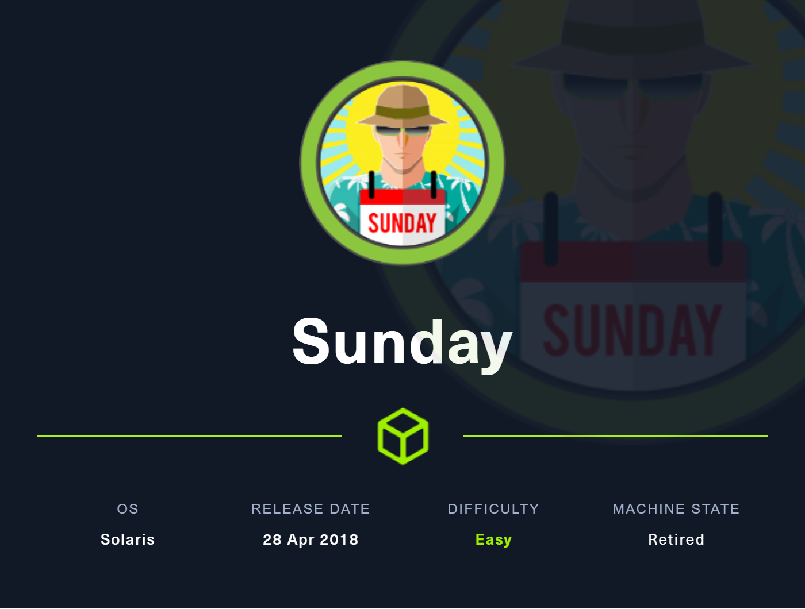
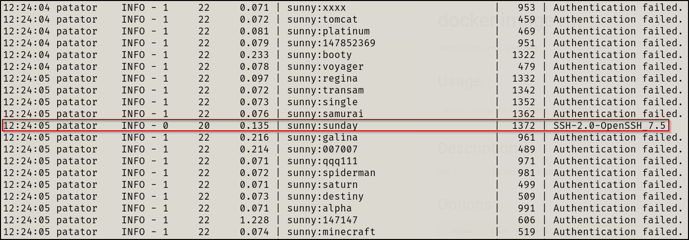
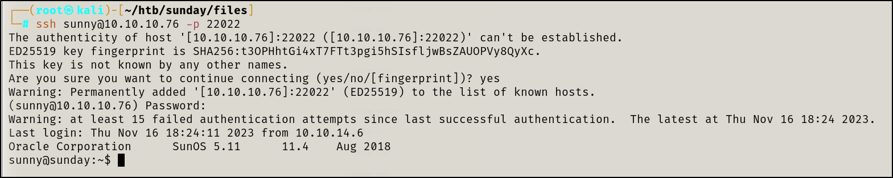
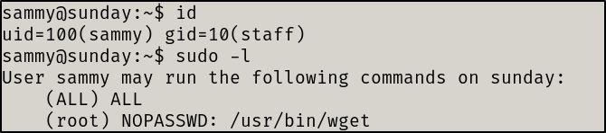
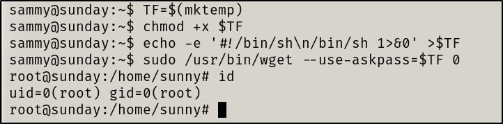

***TABLE OF CONTENTS:***
- [Information Gathering](#information-gathering)
- [Enumeration](#enumeration)
  - [TCP Port 79 - finger?](#tcp-port-79---finger)
  - [TCP Port 22022 - SSH](#tcp-port-22022---ssh)
- [Exploitation](#exploitation)
  - [SSH Bruteforce Attack](#ssh-bruteforce-attack)
- [Privilege Escalation](#privilege-escalation)
  - [Local enumeration](#local-enumeration)
  - [Lateral Escalation](#lateral-escalation)
  - [Privilege Escalation](#privilege-escalation-1)
- [Resolution summary](#resolution-summary)
  - [Improved skills](#improved-skills)
  - [Used tools](#used-tools)
---

# Information Gathering

Scanned all TCP ports:

```bash
#nmap scan
nmap -sV -sC -v -p- -T4 -oN nmap/initial $IP --open

#nmap results
PORT      STATE SERVICE  VERSION
79/tcp    open  finger?
|_finger: No one logged on\x0D
| fingerprint-strings: 
|   GenericLines: 
|     No one logged on
|   GetRequest: 
|     Login Name TTY Idle When Where
|     HTTP/1.0 ???
|   HTTPOptions: 
|     Login Name TTY Idle When Where
|     HTTP/1.0 ???
|     OPTIONS ???
|   Help: 
|     Login Name TTY Idle When Where
|     HELP ???
|   RTSPRequest: 
|     Login Name TTY Idle When Where
|     OPTIONS ???
|     RTSP/1.0 ???
|   SSLSessionReq, TerminalServerCookie: 
|_    Login Name TTY Idle When Where
111/tcp   open  rpcbind  2-4 (RPC #100000)
515/tcp   open  printer
6787/tcp  open  ssl/http Apache httpd 2.4.33 ((Unix) OpenSSL/1.0.2o mod_wsgi/4.5.1 Python/2.7.14)
|_http-server-header: Apache/2.4.33 (Unix) OpenSSL/1.0.2o mod_wsgi/4.5.1 Python/2.7.14
| tls-alpn: 
|_  http/1.1
| http-title: Solaris Dashboard
|_Requested resource was https://10.10.10.76:6787/solaris/
| http-methods: 
|_  Supported Methods: GET HEAD POST OPTIONS
|_ssl-date: TLS randomness does not represent time
| ssl-cert: Subject: commonName=sunday
| Subject Alternative Name: DNS:sunday
| Issuer: commonName=sunday/organizationName=Host Root CA
| Public Key type: rsa
| Public Key bits: 2048
| Signature Algorithm: sha256WithRSAEncryption
| Not valid before: 2021-12-08T19:40:00
| Not valid after:  2031-12-06T19:40:00
| MD5:   6bd3:4b32:c05a:e5fe:a8c8:61f0:4361:414a
|_SHA-1: a5eb:c880:968c:84aa:10b2:a944:bad2:56ca:aed5:b66a
22022/tcp open  ssh      OpenSSH 7.5 (protocol 2.0)
| ssh-hostkey: 
|   2048 aa:00:94:32:18:60:a4:93:3b:87:a4:b6:f8:02:68:0e (RSA)
|_  256 da:2a:6c:fa:6b:b1:ea:16:1d:a6:54:a1:0b:2b:ee:48 (ED25519)
```

# Enumeration

## TCP Port 79 - finger?

Downloaded a finger service enumerator from [pentestmonkey](https://pentestmonkey.net/tools/finger-user-enum)

Ran the tool using a user wordlist of `/usr/share/wordlists/seclists/Usernames/xato-net-10-million-usernames.txt` and received the following results

```bash
root@10.10.10.76: root     Super-User            console      <Oct 14, 2022>..
sammy@10.10.10.76: sammy           ???            ssh          <Apr 13, 2022> 10.10.14.13         ..
sunny@10.10.10.76: sunny           ???            ssh          <Apr 13, 2022> 10.10.14.13         ..
```

Now, we have 3 valid users to target

These users have logged in via ssh so lets try bruteforcing SSH

## TCP Port 22022 - SSH

Users have logged in by SSH via information found from `finger-user-enum`

Time to bruteforce and hope for some weak creds!

---

# Exploitation

## SSH Bruteforce Attack

Performed a bruteforce attack via `Patator` to login via SSH

```bash
patator ssh_login host=10.10.10.76 user=FILE0 password=FILE1 1=/usr/share/wordlists/seclists/Passwords/xato-net-10-million-passwords-10000.txt 0=user.txt port=22022
```



Boom, creds gained



Initial access gained 😎

---

# Privilege Escalation

## Local enumeration

Sunny user was able to navigate to `/home/sammy` and retrieve the user flag

Found a `backup` directory which is not in Linux by default so I looked into it and found hashes


I took those hashes and ran `hashcat` in hopes to crack another user hash


I was able to crack `sammy` ’s hash

## Lateral Escalation

I proceeded to switch to the `sammy` account to see if the user had more permissions that would allow us to achieve `root`



I quickly found that the `sammy` user could run `wget` as `root` . 

## Privilege Escalation

We will make short work of this thanks to [GTFOBins](https://gtfobins.github.io/gtfobins/wget/#sudo). The steps taken to escalate privileges via `wget` are shown below.



---

# Resolution summary

- Enumerate the finger service to find valid users
- Attempt a bruteforce attack via SSH
- Navigate to /backup and extract the contents
- Attempt to crack the hashes via Hashcat
- Laterally Escalate privileges with new credentials
- Escalate privileges to root thanks to wget sudo permissions

## Improved skills

- Learned two new tools: Patator and finger-user-enum
- How to enumerate the finger service
- How to bruteforce via SSH(and many other services) when Hydra fails

## Used tools

- nmap
- finger-user-enum
- hashcat
- ssh
- Patator


> "It's not that I'm so smart, it's just that I stay with problems longer." - Albert Einstein
